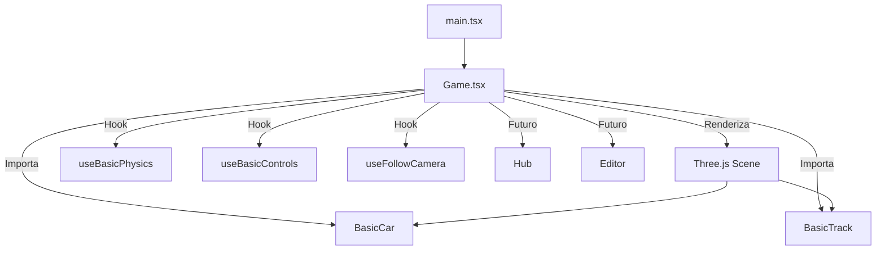
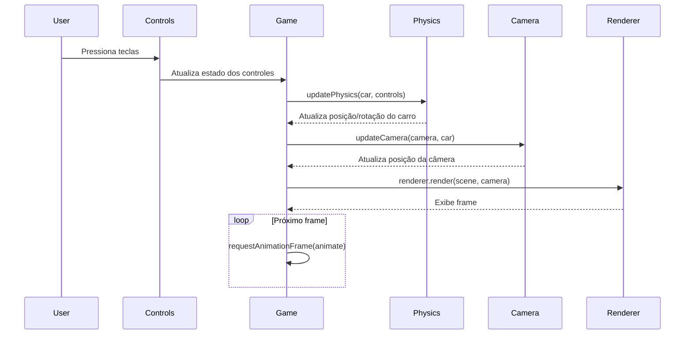

# Jogo de Corrida 3D - Arquitetura e Fluxos

Este projeto é um jogo de corrida 3D modularizado em React, TypeScript e Three.js, preparado para expansão futura (editor, hub, múltiplos carros e pistas).

## Diagrama de Arquitetura



## Diagrama de Sequência (Loop Principal)



## Estrutura de Pastas

```text
src/
  core/         # Game principal, estilos
  cars/         # Carros e módulos relacionados
  tracks/       # Pistas e módulos relacionados
  physics/      # Física e hooks
  controls/     # Controles e hooks
  camera/       # Câmera e hooks
  hub/          # Hub do jogo (futuro)
  editor/       # Editor visual (futuro)
docs/           # Documentação e diagramas
```

---

> Os diagramas Mermaid acima podem ser visualizados no VS Code com extensões apropriadas ou em sites como [Mermaid Live Editor](https://mermaid.live/).
